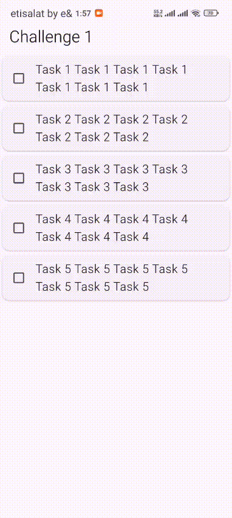

## 🏆 Challenge 1: Interactive Dismissible Lists

This is a small Flutter widget for managing tasks.  
Users can **swipe to delete** tasks and **drag to reorder** them.  

### Features:
- Swipe-to-delete with confirmation dialog  
- Drag-to-reorder tasks  
- Undo deleted tasks with SnackBar  
- 5 sample tasks included  

Here is a demo of the widget:

